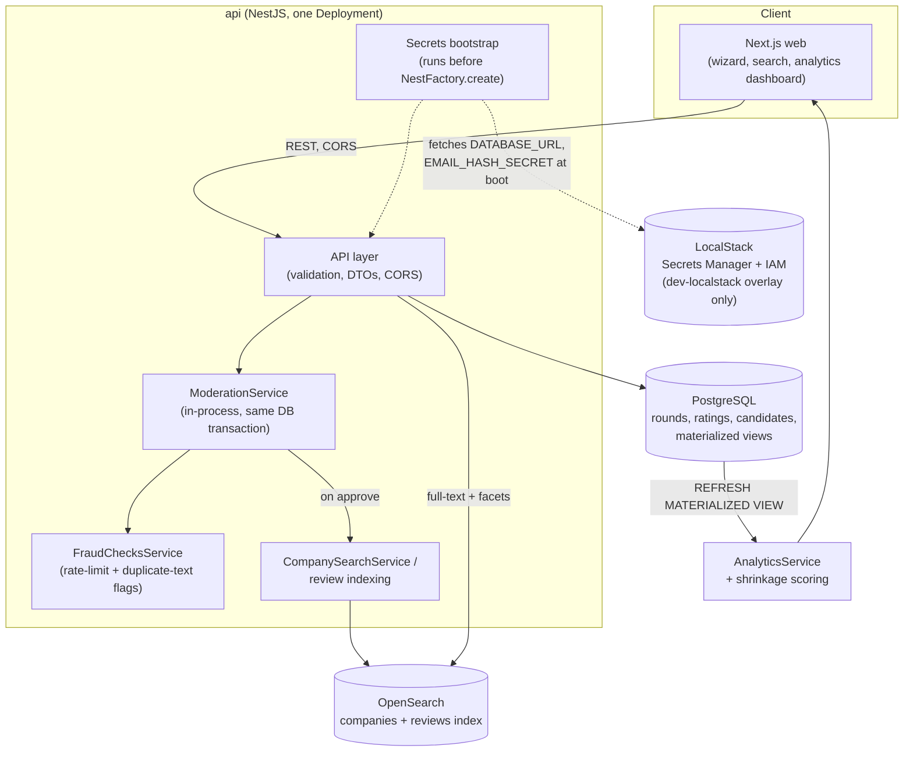
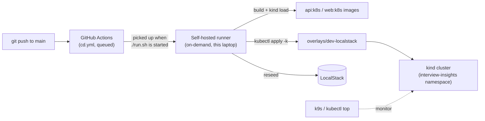

# Architecture

*This doc describes what's actually built and running as of Phase 12,
not the Phase 1 target state. Where the original plan changed, that's
called out explicitly rather than silently rewritten — see
`docs/DECISIONS.md` for the reasoning behind each change.*

## System overview (current)





No Kafka, Redis, or ClickHouse were ever built — see "What changed from
the original plan" below.

## Component inventory (what's actually running, and why)

| Layer | Technology | Status |
|---|---|---|
| Frontend | Next.js + Tailwind (`web/`) | Wizard, search, analytics dashboard — all live |
| API | NestJS (`api/`) | REST, DTO validation, CORS, Prisma ORM |
| Primary store | PostgreSQL | All entities + 3 materialized views (Phase 4) |
| Moderation | In-process NestJS module (D12) | Only `RoundRating` has a write path (see gaps below) |
| Fraud checks | In-process, same module family | Rate-limit (3/24h) + duplicate-text flag, never blocks writes (D13) |
| Search | OpenSearch | Company + review indexes, best-effort sync writes (D16/D17) |
| Secrets/IAM | LocalStack (dev-localstack overlay) | Default CD target as of Phase 12 issue #99 (D23) |
| Orchestration | Kubernetes via `kind` | `infra/k8s/base` + `overlays/{dev,dev-localstack,staging,prod}` |
| Ingress | `ingress-nginx` (Helm) | Host-based routing, `app.`/`api.interview-insights.local` |
| Cluster monitoring | `metrics-server` (Helm) + `k9s` | Phase 12 issue #90 |
| CI | GitHub Actions, GitHub-hosted runners | Lint/build/test on every PR |
| CD | GitHub Actions, self-hosted on-demand runner | Auto-triggered on push to `main`, executed only when `./run.sh` is started (Phase 12) |
| `workers/` | Placeholder | No logic — moderation stayed in-process (D12), never needed a separate consumer |
| `infra/terraform/` | Placeholder | Empty until a real cloud account exists (Phase 8+) |

## Why this shape

- **Postgres as primary store, not a document DB.** The domain is
  relational by nature — rounds belong to processes, ratings belong to
  rounds, aggregates roll up hierarchically. JSONB columns (`type_metadata`)
  absorb the genuinely flexible parts without forcing the whole schema
  into a document model.
- **Materialized views, and so far that's still enough (D9).** Three
  materialized views (`company_round_type_aggregates`,
  `company_recruiter_aggregates`, `company_overall_aggregates`) power the
  analytics dashboard. ClickHouse was the original Plan B if these ever
  strained under load — that point has never been reached, so it was
  never built. Not deferred vaguely; there's a concrete "revisit when
  views measurably strain" trigger and it hasn't fired.
- **Moderation runs in-process, not as a Kafka consumer (D12).** The
  original plan had a separate event-bus-driven moderation worker. What
  actually shipped: `RoundRatingsService.create()` inserts a
  `moderation_queue` row in the *same DB transaction* as the rating —
  simpler, transactionally safe, and there's been no async load yet to
  justify decoupling it. No Kafka/Redpanda was ever deployed; `workers/`
  stayed an empty placeholder for exactly this reason.
- **No Redis.** The original plan included Redis for hot aggregates and
  sessions. Neither materialized, so it was never added — same
  "don't build infrastructure nothing is asking for yet" instinct as D9.
- **Search is separate from the primary store.** Postgres full-text
  search doesn't scale well to the faceted search a company/review
  browsing experience needs (role, round type, date range) — OpenSearch
  is purpose-built for that, and indexing is best-effort/derived (D16):
  Postgres stays the source of truth, OpenSearch can be rebuilt from it.
- **Helm for third-party infra, Kustomize for our own (D19).** `ingress-nginx`
  and `metrics-server` are Helm-installed — they're maintained upstream
  and distributed as charts specifically for `helm upgrade`/`rollback` to
  track. `api`/`web`/`postgres`/`opensearch` stay Kustomize-managed
  (`infra/k8s/base` + environment overlays) — 2-4 services isn't
  "genuinely repetitive" enough to justify Helm for our own manifests yet.
- **LocalStack backs local secrets/IAM by default, not real AWS (D20/D22/D23).**
  `api` assumes an IAM role via STS and fetches `DATABASE_URL`/
  `EMAIL_HASH_SECRET` from LocalStack Secrets Manager at boot — genuinely
  exercised on every local CD run, not just proven once. This is
  local-only practice for Phase 8b/8d, explicitly not a production
  secrets solution: LocalStack's free tier doesn't evaluate IAM policies
  for real and doesn't emulate EKS.
- **CD reconciles a real automatic trigger with a deliberately
  session-scoped runner (Phase 12).** `cd.yml` triggers on every push to
  `main` that touches `api/**`/`web/**`/`infra/k8s/**` — a genuine `on:
  push`, not `workflow_dispatch`. But the runner that executes it is
  on-demand, not a persistent service: nothing repo-triggered runs on
  this machine unless a session explicitly starts `./run.sh` first.

## What changed from the original plan

The Phase 1 version of this doc described a target state that included
Kafka/Redpanda (event bus), Redis (cache), and ClickHouse (OLAP). None
of the three were ever built. This isn't drift to quietly paper over —
each is a real, deliberate decision, documented in `docs/DECISIONS.md`:
D9 (materialized views before ClickHouse), D12 (moderation in-process,
no event bus). Redis was never revisited because nothing has needed a
cache yet. If any of these get built later, it'll be because a concrete
trigger fired (real load, real async fan-out), not because the original
diagram said so.

## Deployment shape (current)

- **Local dev, native (fastest):** `api`/`web` run directly with `npm
  run start:dev`, against a Dockerized Postgres — no containers for the
  app code itself. See `wiki/deployment-guide.md` §1.
- **Local dev, full Docker Compose:** `docker compose --profile full up
  --build` — Postgres, OpenSearch, LocalStack, `api`, `web`, all
  containerized. §2.
- **Local dev, full Kubernetes (`kind`):** the closest thing to a real
  deployment this project has. `ingress-nginx` + `metrics-server` via
  Helm; `api`/`web`/`postgres`/`opensearch`/`localstack` via Kustomize
  (`infra/k8s/base` + `overlays/dev-localstack`). §3.
- **CD:** on every push to `main` touching deployable paths, a job
  queues automatically; starting the self-hosted runner picks it up and
  runs build → `kind load` → `kubectl apply -k overlays/dev-localstack`
  → provision + reseed LocalStack → rollout restart, fully automated.
  §4, §7, §8.
- **`staging`/`prod` overlays exist but have never been deployed** —
  structurally complete (own namespace, replica counts, resource limits,
  distinct Ingress hosts), verified to produce valid, genuinely-differing
  `kubectl kustomize` output, but gated on a real Phase 8 trigger (an
  actual shared/staging environment) that hasn't fired yet.
- **CI:** GitHub Actions, GitHub-hosted runners — lint, type-check, test,
  build on every PR, unchanged since Phase 1.

## Repo layout (current)

```
interview-insights/
├── CLAUDE.md
├── docs/
│   ├── ARCHITECTURE.md        (this file)
│   ├── DATA_MODEL.md
│   ├── DECISIONS.md
│   └── ROADMAP.md
├── api/
│   ├── src/
│   │   ├── candidates/ candidate-verification/
│   │   ├── companies/ interview-processes/ rounds/ round-ratings/
│   │   ├── moderation/ fraud-checks/
│   │   ├── search/ analytics/ secrets/ health/ common/
│   │   └── main.ts app.module.ts
│   ├── prisma/                # schema.prisma + migrations/
│   ├── scripts/entrypoint.js  # runs secrets bootstrap before migrate + app
│   └── Dockerfile
├── web/
│   └── src/app/                # wizard, search, analytics pages
├── workers/                    # placeholder — no logic (D12)
├── infra/
│   ├── docker-compose.yml      # postgres (default) / --profile full / --profile localstack
│   ├── aws/                    # seed-localstack.sh, IAM policy JSON
│   ├── k8s/
│   │   ├── base/                # numbered manifests + localstack/ subdir
│   │   └── overlays/
│   │       ├── dev              # the exact shape actually deployed
│   │       ├── dev-localstack   # dev + LocalStack, CD's actual target
│   │       ├── staging / prod   # structural only, gated on Phase 8
│   └── terraform/               # empty, gated on a real cloud account
├── wiki/
│   ├── deployment-guide.md      # command-by-command runbook, every environment
│   ├── github-project-setup.md  # gh CLI workflow conventions
│   └── blog/                    # one post per issue, narrative deep-dives
└── .github/workflows/           # ci.yml, cd.yml, self-hosted-smoke-test.yml
```

## Known gaps (surfaced, not yet acted on)

- **`RecruiterInteraction`/`RecruiterRating`/`OverallReview` have zero
  write path.** The schema and migrations have existed since Phase 1,
  but no controller anywhere creates one, `ModerationService` explicitly
  throws `NotImplementedException` for either type, and the two
  corresponding materialized views (`company_recruiter_aggregates`,
  `company_overall_aggregates`) are permanently empty — not "below the
  shrinkage floor," genuinely zero rows possible. The analytics
  dashboard's "recruiter experience" and "overall experience" sections
  will show "Not enough reviews yet" indefinitely until this is built.
  This is a real, sizeable feature gap — building it out is a scoped
  decision for a future planning pass, not something implied by this doc.
- **Candidate email verification (Phase 3, issue #3) has no UI trigger.**
  The token issue/verify endpoints are fully built and tested but no page
  in `web/` calls either one — only reachable via direct API calls today.
- **Fraud/spam volume growth** — the moderation service will need real ML
  scoring (not just rules) once volume grows; revisit as a dedicated
  workstream, don't bolt it onto the write path later.
- **Cross-company comparison queries** — once `normalized_band` is
  populated (see `docs/DATA_MODEL.md`), comparison queries across many
  companies may need their own materialized view rather than joining live.
- **Cold start** — no candidate rates a company with zero existing
  reviews. Likely needs seed data before organic growth kicks in. Not an
  infrastructure concern, but affects launch sequencing.
